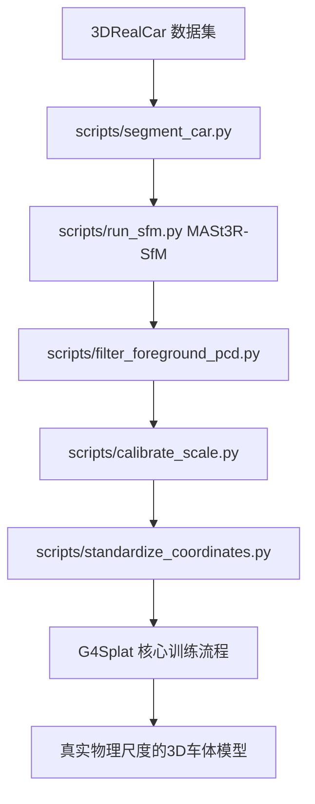

# G4Splat 车体分割与尺度映射优化方案 (正式规范)

## 1. 目标与概述

### 1.1 核心目标
本方案旨在为 G4Splat 引入针对 3DRealCar 数据集的深度优化，解决以下核心问题：
1.  **背景干扰**: 通过车体分割，实现仅针对车辆区域 of 3DGS 重建。
2.  **尺度缺失**: 利用 ARKit 轨迹元数据，将重建结果对齐到真实物理尺度（单位：米）。
3.  **坐标系杂乱**: 自动建立以车辆中心为原点的 ego-vehicle 坐标系（X-Forward, Z-Up）。

### 1.2 兼容性说明
本方案深度参考并兼容 **3DRealCar_Toolkit** 的官方数据处理流程，确保在真实世界场景下的重建精度。

---

## 2. 优化后的完整 Pipeline



---

## 3. 核心模块详解

### 3.1 车体分割 (Car Segmentation)
*   **脚本**: `scripts/segment_car.py`
*   **技术栈**: GroundingDINO (检测) + SAM (分割)
*   **功能**: 在 `source_path/masks/sam/` 下生成 `.npy` 掩码文件。
*   **关键特性**: 支持断点续跑，自动跳过已处理帧；使用 "car mask" 作为引导。

### 3.2 前前景过滤 (Foreground Filtering)
*   **脚本**: `scripts/filter_foreground_pcd.py`
*   **逻辑**: 读取 SfM 产出的 `points3D.bin`，投影至各帧视角。只有在掩码区域内出现次数超过阈值的点才会被保留。
*   **输出**: `output/<name>/mast3r_sfm/sparse_fg/0/`
*   **意义**: 极大减少背景噪声，提升车辆表面的 Gaussian 密度。

### 3.3 尺度校准 (Scale Calibration)
*   **脚本**: `scripts/calibrate_scale.py`
*   **核心逻辑**:
    1.  **帧对齐**: 通过图像文件名（如 `0000.jpg`）精确匹配 `arkit/0000.json`。
    2.  **轨迹比对**: 对比 SfM 估计的相机轨迹与 ARKit 记录的物理轨迹。
    3.  **尺度还原**: 计算比例因子并将点云、相机平移向量统一映射到物理“米”单位。
*   **验证**: 产生的 `meta.json` 记录了最终 Scale 值，模型单位对齐至真实长度。

### 3.4 坐标标准化 (Coordinate Standardization)
*   **脚本**: `scripts/standardize_coordinates.py`
*   **坐标系定义**:
    *   **原点 (0,0,0)**: 车体包围盒中心在地面的投影。
    *   **X 轴**: 车身主方向（指向车头）。
    *   **Z 轴**: 垂直于地面（指向车顶）。
*   **实现**: 基于 PCA（主成分分析）自动估计车身朝向。

---

## 4. 目录层级规范

处理过程中，`output` 目录将保持以下结构，每一步均可独立查看：

```
output/<scene_name>/
└── mast3r_sfm/
    ├── sparse/0/            # Step 1: 原始 SfM 产物 (归一化尺度)
    ├── sparse_fg/0/         # Step 2: 过滤后车体点云
    ├── sparse_scaled/0/     # Step 3: 物理尺度还原后 (单位: 米)
    └── sparse_final/0/      # Step 4: 标准坐标系化后 (最终输入)
```

---

## 5. 使用指南

### 5.1 环境要求
确保已安装以下依赖（参考 3DRealCar 官方说明）：
```bash
pip install groundingdino-py segment-anything supervision
```

### 5.2 运行全流程
直接在 `train.py` 中开启相关开关即可实现一键处理：
```bash
python3 train.py \
    -s <数据集路径> \
    --use_car_segmentation \
    --filter_foreground \
    --use_arkit_scale \
    --standardize_coordinates
```

### 5.3 调试与验证
*   **查看中间点云**: 使用 Meshlab 打开 `sparse_scaled/points3D.ply`，使用测量工具检查车辆长度是否接近现实（如 4-5 米）。
*   **检查掩码**: 查看 `source_path/masks/sam/*_vis.jpg` 确认分割是否准确。

---

## 6. 风险缓解与注意事项
1.  **帧率不匹配**: MASt3R 可能会剔除 SfM 失败的帧，`calibrate_scale` 已处理此类情况，仅使用匹配成功的图像进行尺度估计。
2.  **尺度异常**: 脚本设置了 `0.8 - 5.0` 的安全阈值，若超出此范围会发出警告，提示检查 ARKit 数据的完整性。
3.  **PCA 翻转**: 标准化模块会自动通过相机平均位置判断 Z 轴正方向，防止模型上下颠倒。
